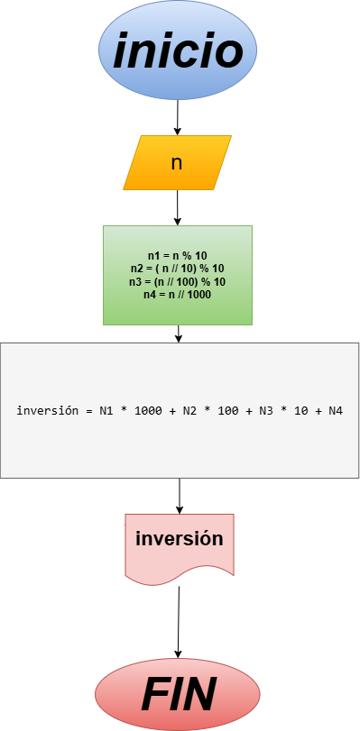

# Programa #3: Invertir número entero de 4 dígitos

Programa en Python para invertir un número entero de cuatro dígitos ingresado por el usuario.

# Instrucciones:
 - Digite un número entero de 4 dígitos y el programa mostrará el número invertido.

### Variables de entrada
 - $N$: Número entero de 4 dígitos

### Procesamiento
 - $N1$: Unidad del número  
 - $N2$: Decena del número  
 - $N3$: Centena del número  
 - $N4$: Millar del número  

 - $N1 = N \% 10$
 - $N2 = (N // 10) \% 10$
 - $N3 = (N // 100) \% 10$
 - $N4 = N // 1000$

 - $invertido = N1 * 1000 + N2 * 100 + N3 * 10 + N4$

## Diseño

## Construcción
 - Código implementado en el archivo "invertir numero entero.py"
